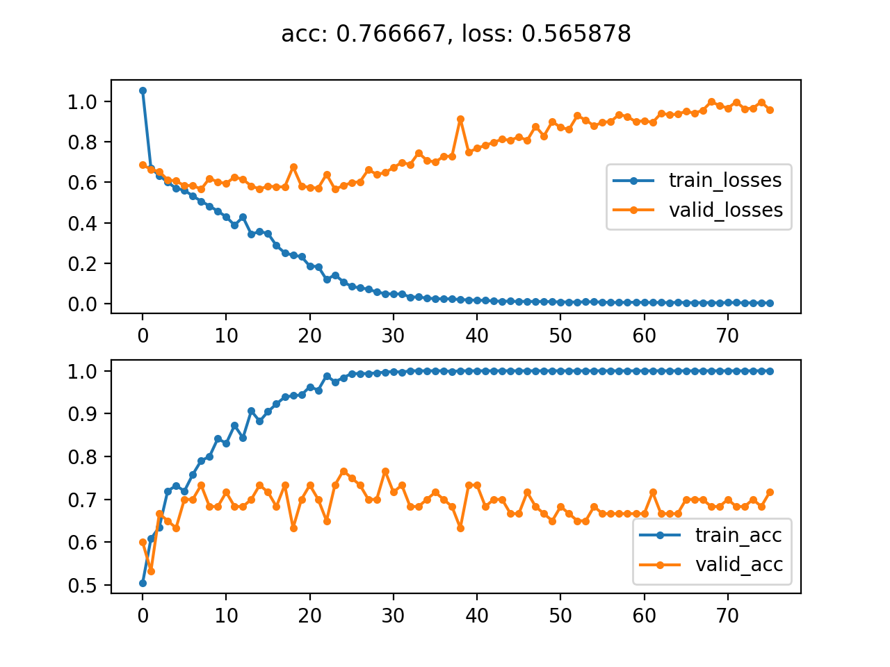
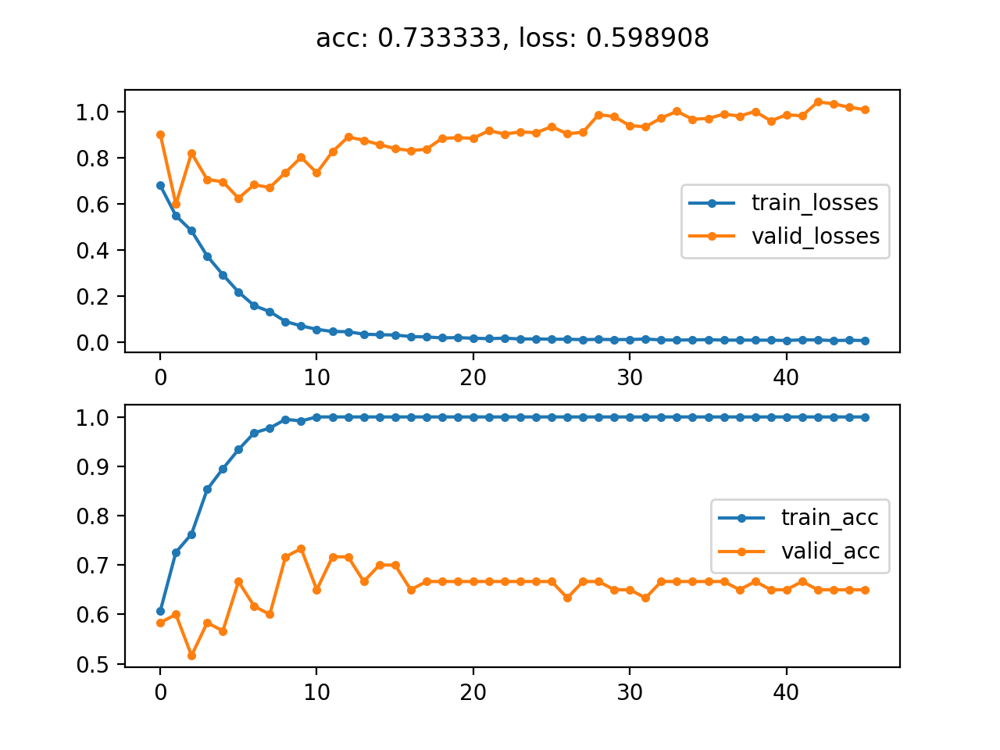
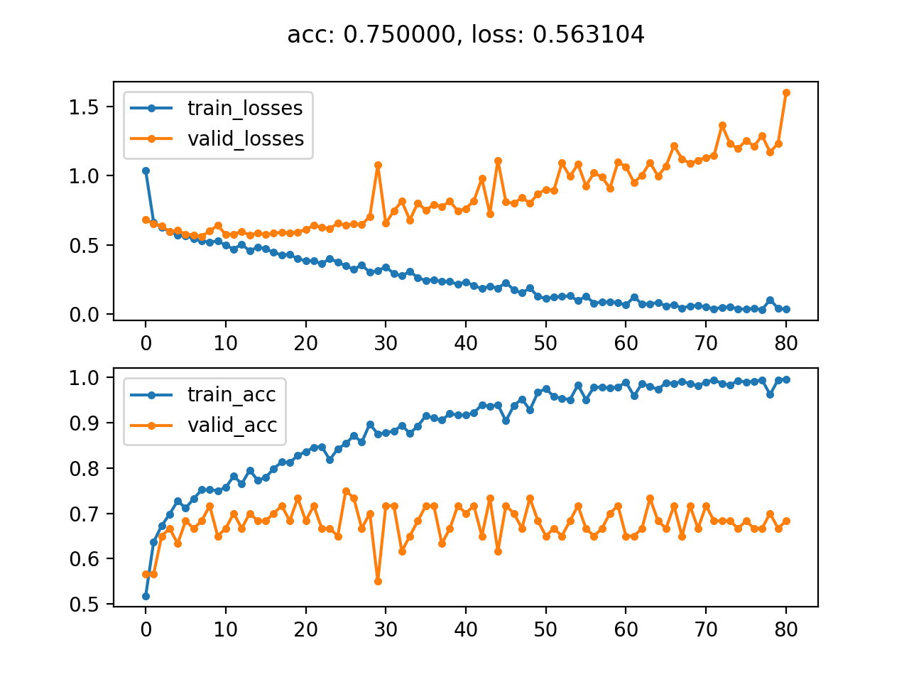
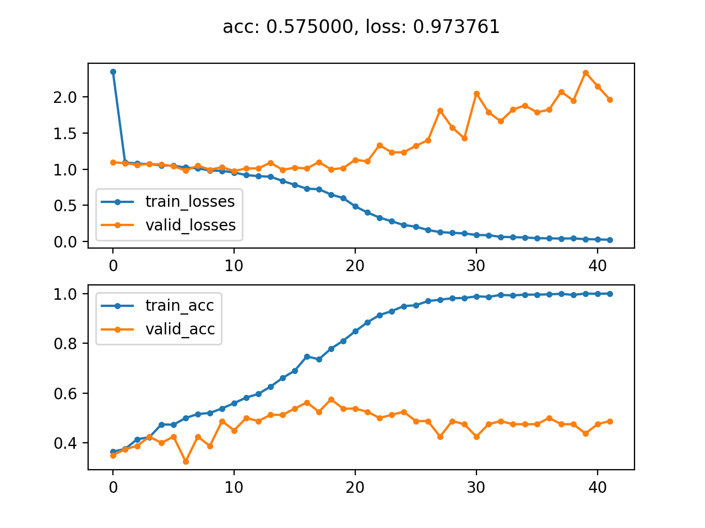
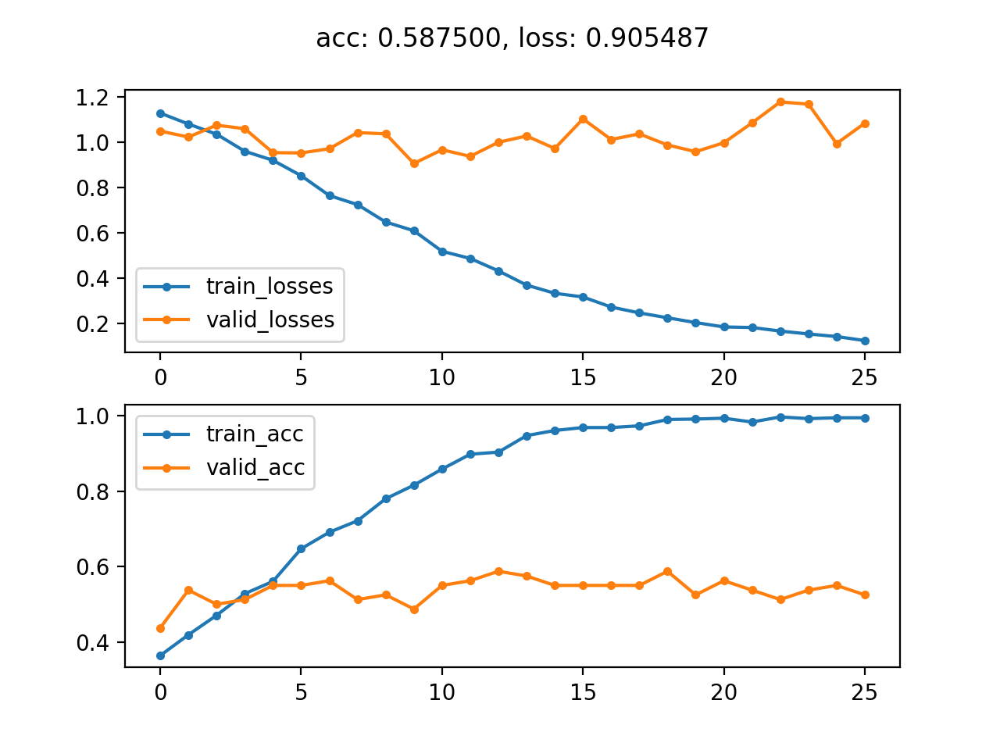
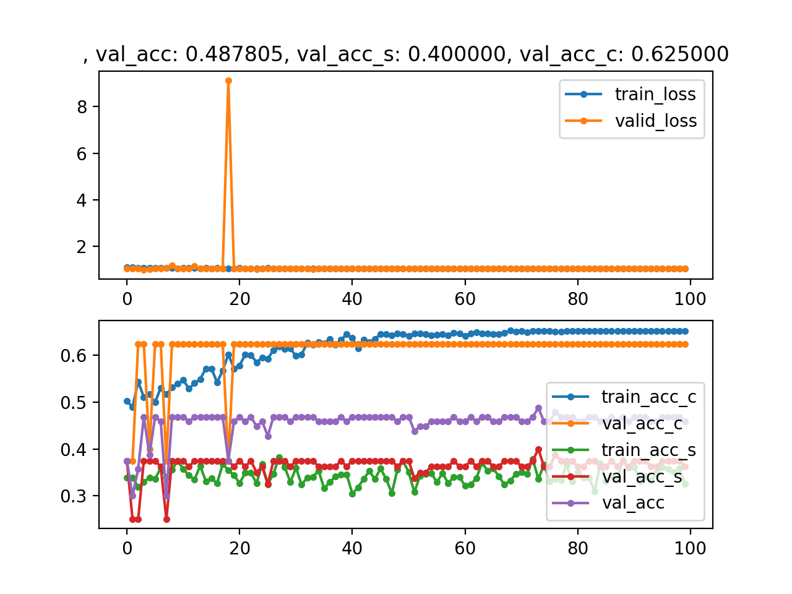

# 动物多分类实战

## stage1: Classes_classification

`stage1`在项目说明的基础上，去掉了`nn.Softmax`。使用
`nn.init.kaiming_normal_`对所有维度大于或等于2的参数进行初始化。数据集的`transform`只保留了`Resize`。`stage1`使用不同参数进行了三次训练。

基本配置:

```json
{"phase": "train", "batch_size": 64, "test_batch_size": 64, "epochs": 100, "lr": 0.01, "momentum": 0.5, "no_cuda": false, "seed": 1, "log_interval": 5, "save_model": true, "model": "Net", "save_directory": "out", "data_directory": null, "model_file": null, "predict_indices": "all", "no_cache_image": false, "retry": true}
```

### `Net`: 默认配置



### `Net_BN`: 在`fc`层前面加上`batch normalization`



### `Net`，数据集加上`transforms.RandomRotation(10)`



## stage2: Species_classification

### `Net`



### `Net_BN`



## stage3: Multi-classification

`stage3`在两个`fc`层前面分别加上`batch normalization`

`loss = loss_species * 0.9 + loss_classes * 0.1`(因为`classes`实际上可以有`species`推导出来，所以想优先训练`species`)

`acc = 2.0/(1.0/acc_species + 1.0/acc_classes)`



## 问题

- 几次训练都有过拟现象，但是对数据进行增广后，`val_acc`不仅没提高，反而下降了。
