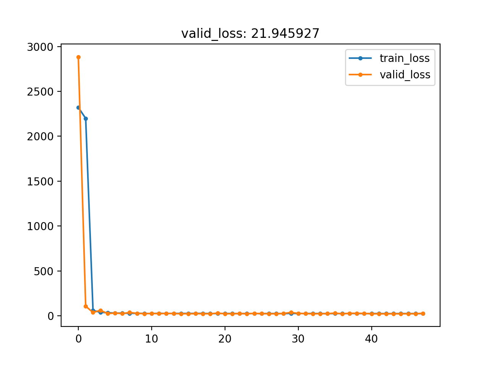
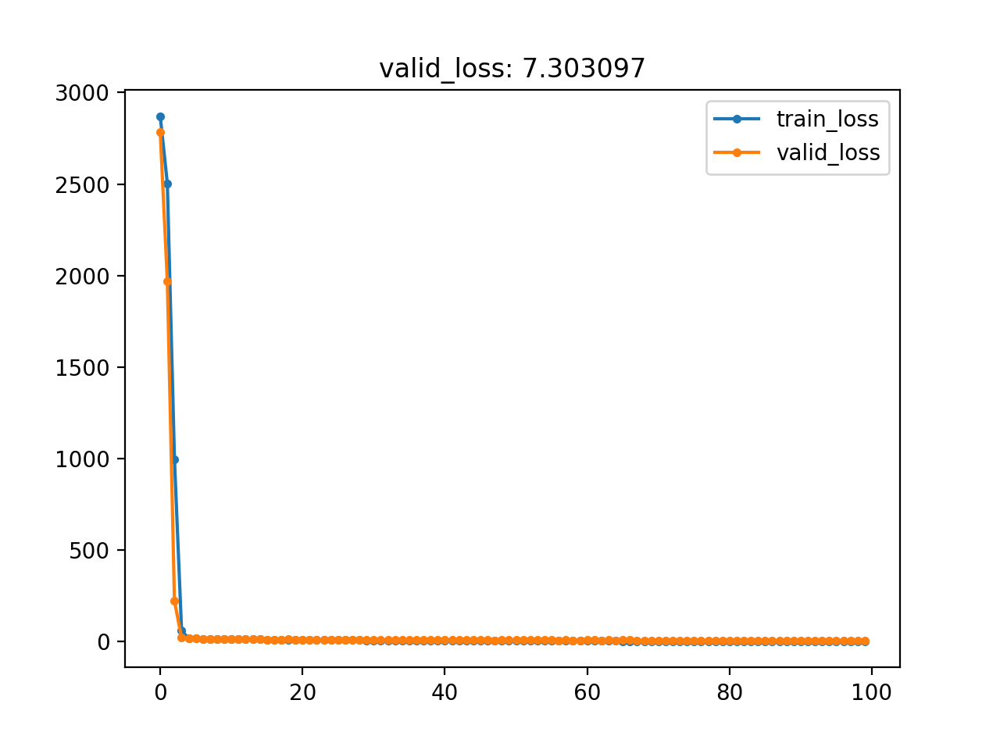

# proj2

## stage 1

Outline

- 原始数据
- 网络
- 训练框架的搭建
- 如何读取数据
- Train部分
- Test、Predict 与 Finetune 部分

### 1. 生成 train/test.txt

```bash
python -m generate_train_test_list -h
python -m generate_train_test_list
```

### 2. 网络搭建

1. 数据在网络中的维度顺序是什么?
2. nn.Conv2d()中参数含义与顺序?
3. nn.Linear()是什么意思?参数含义与顺序?
4. nn.PReLU()与 nn.ReLU()的区别?示例中定了很多 nn.PReLU()，能否只定义一个PReLU?
   1. 不能只定义一个`PReLU`，因为每个`PReLU`都有一个参数，需要分开训练。
5. nn.AvgPool2d()中参数含义?还有什么常用的 pooling 方式?
6. view()的作用?
7. 体会 forward 中，网络如何被构建。
8. 注意返回值返回的并不是 loss

### 3. 主体程序框架的搭建

### 4. 补全 `FaceLandmarksDataset()`

### 5. 补全 `main` 函数

### 6. 完成训练的任务

### 7. 完成 `Test\Predict\Finetune` 代码

### 结果



## stage 2

> 总之，希望大家能给出一个秒杀 stage1 的 model

`NetBN`



### 1. 关于数据

### 2. 关于训练方法

### 3. 关于网络

### 4. 关于目标

### 5. 关于 loss

## stage 3

> 因此，真实场景中，是否应该再加入分类分支呢?

### 1. 为网络加入分类分支

### 2. 生成非人脸数据

### 3. 重新生成 train/test.txt

### 4. 对于 loss 的处理

### 5. 关于检测
