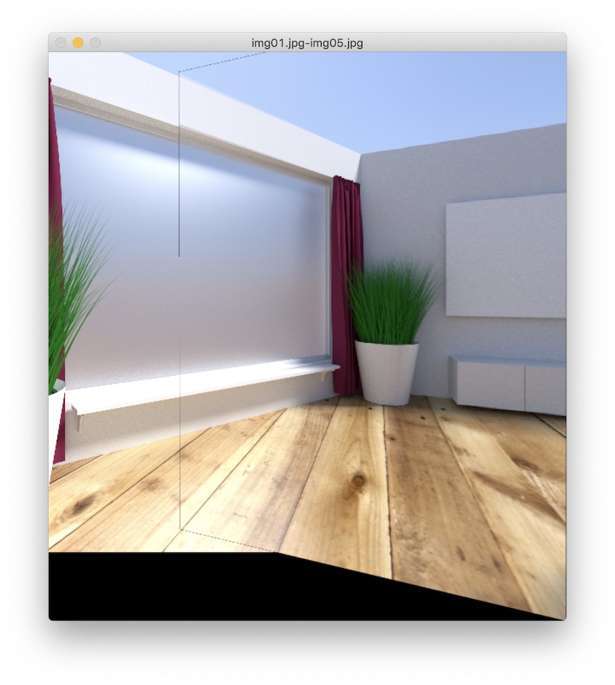
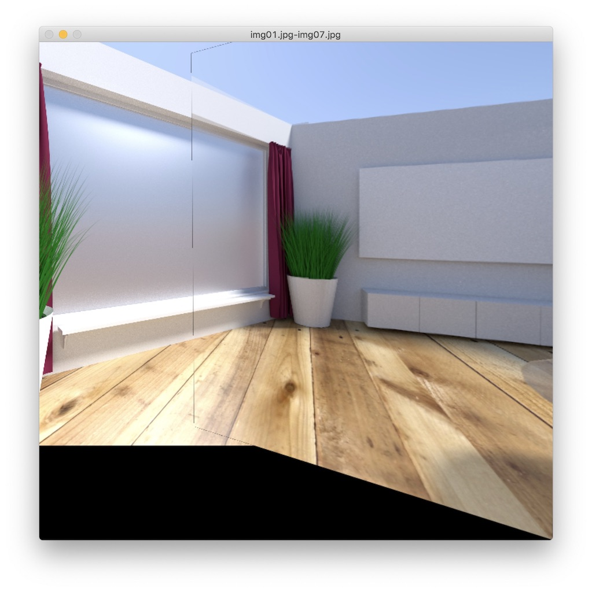

# Image Stitching

- [x] Classical image stitching!

  > [p1_image_stitching.py](p1_image_stitching.py): `python -m p1_image_stitching /path/to/left/image /path/to/right/image`

  图片来源: [PASSTA Datasets/Lunch Room](http://www.cvl.isy.liu.se/en/research/datasets/passta/)

  【步骤】：
  - 检测特征点
  - 匹配特征点
  - 计算变换矩阵
  - 混合图片

  【下一步】：
  - 消除裂缝
  - 对两张图都进行投射，而不是一张位移，一张投射
  - 多张图拼接
  - 对比每个步骤不同方案的效果

  【效果】：
  
  
  
  
