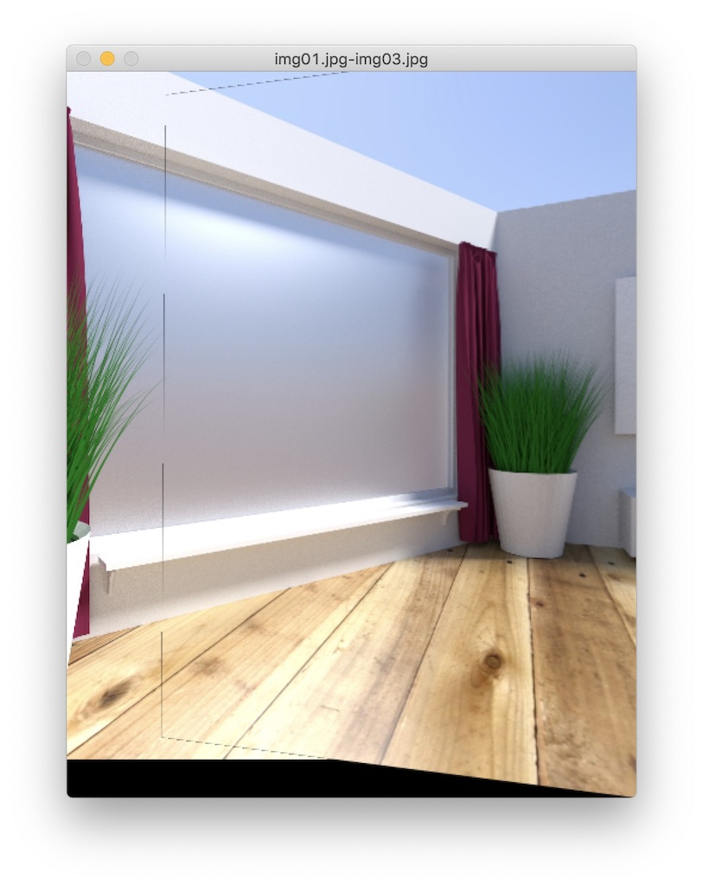
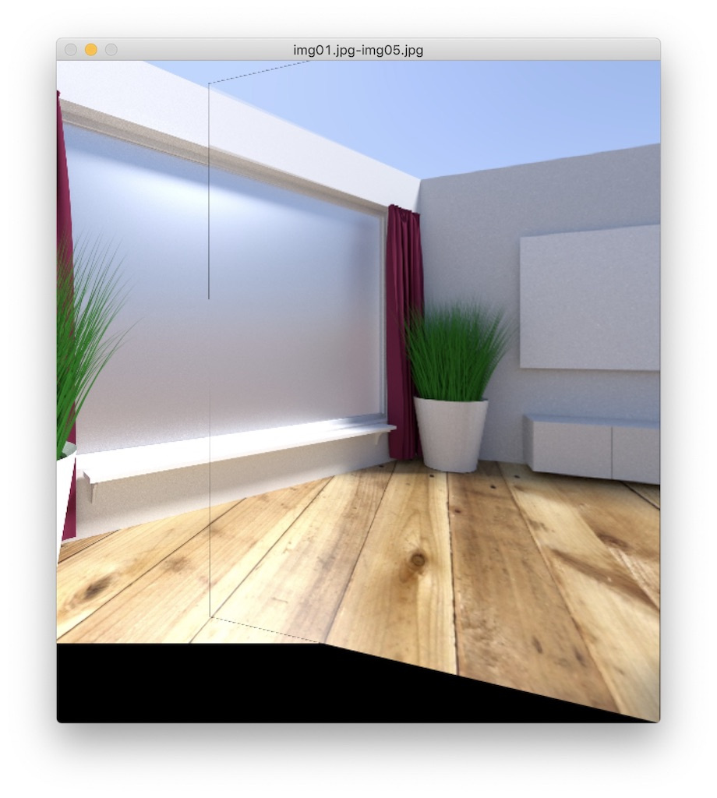
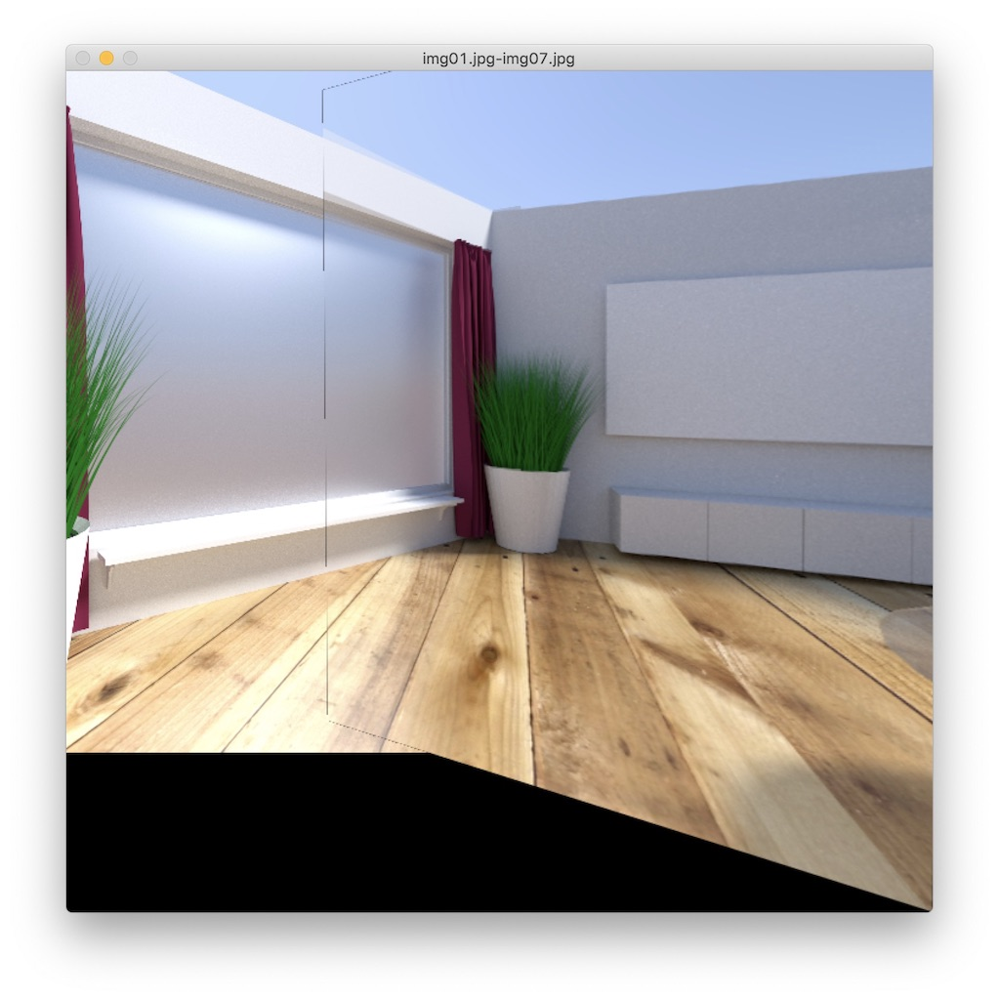
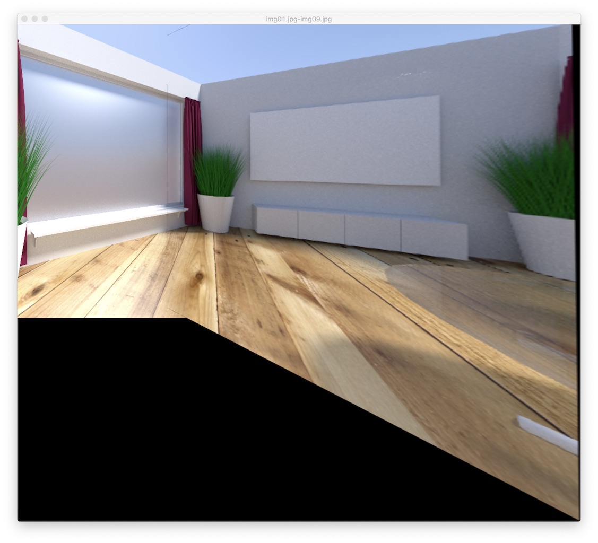

# week2

## Reading

- [ ] Bilateral Filter
- [x] Hog
- [x] SURF
- [x] BRISK
- [x] Orb
- [x] K-Means

## Coding

- [x] Finish 2D convolution/filtering by your self. ("median blur")
- python: [c1_median_blur.py](./c1_median_blur.py)
  - 测试: `python -m c1_median_blur_test`
  - 过滤效果: `python -m c1_median_blur`
- c++: [c1_median_blur.cpp](./c1_median_blur.cpp)
  - 编译运行: `cd cmake && cmake . && make && build/week2_test`

- 寻找中位值：可以先对卷积核范围内数据排序，然后取出中间位置数据，时间复杂度为：$O(W\cdot H\cdot m\cdot n\cdot log(m\cdot n))$。也可以使用快排算法的变种 `Quick Select` 算法寻找中位值，平均时间复杂度为：$O(W\cdot H\cdot m\cdot n)$
- `O(1)`方案: [Median Filtering in Constant Time](https://files-cdn.cnblogs.com/files/Imageshop/MedianFilterinConstantTime.pdf)
  - 具体实现见 `medianBlurHistogram` 函数(cpp,python版本均已实现)。
  - 通过直方图查找中位值的复杂度：`O(1)`
    - 灰度值深度一般为`8bit`，对灰度值进行直方图统计，共需 `256 bin`。
    - 通过这个直方图查找中位值是 `O(1)` 操作。
    - 虽然平均要进行128次相加和比较操作，但当核尺寸较大时，常数操作优势还是很大的。
  - 维护直方图的复杂度：`O(1)`
    - 对于两个不相交的直方图，有：$H(A\cup B)=H(A)+H(B)$
    - 列直方图的维护：直方图向下移动一个像素，则最上像素的灰度值次数减一，最下像素的灰度值次数加一。共一次加法、一次减法运算。
    - `kernel`直方图的维护：`kernel`直方图为其所在列的列直方图之和。`kernel`向右移动一个列时，则减去最左列的直方图，并加上最右列直方图。共`256`次减法和`256`次加法。

- 这里分别使用内置排序函数、手动实现的快排、`QuickSelect`算法来实现卷积函数，并在 [main.cpp](./main.cpp) 进行测试。得到如下数据：

  ```plaintext
  benchmark name              samples       iterations    estimated
                              mean          low mean      high mean
                              std dev       low std dev   high std dev
  ----------------------------------------------------------------
  quickSelectMedianValue      100           12            7.8852 ms
                              8.49 us       8.376 us      8.676 us
                              724 ns        497 ns        1.002 us
  quickSort                   100           2             13.7564 ms
                              105.796 us    104.584 us    107.549 us
                              7.323 us      5.481 us      9.515 us
  sort(系统内置)                100           60            7.77 ms
                              1.672 us      1.653 us      1.718 us
                              140 ns        69 ns         276 ns


  benchmark name              samples       iterations    estimated
                              mean          low mean      high mean
  256x256x4x4                 std dev       low std dev   high std dev
  -----------------------------------------------------------------
  medianBlur                  100            1          6.4705 s
                              64.6559 ms   64.3684 ms   65.098 ms
                              1.79439 ms   1.32999 ms   2.61546 ms

  medianBlurQuickSort         100            1          13.731 s
                              134.749 ms   134.265 ms   135.401 ms
                              2.8593 ms   2.26561 ms    3.61202 ms

  medianBlurQuickSelect       100            1          9.13892 s
                              88.6994 ms   88.4687 ms   89.0338 ms
                              1.39756 ms   1.07421 ms   2.04641 ms

  medianBlurHistogram         100            1          18.954 s
                              185.228 ms   184.833 ms   185.772 ms
                              2.34721 ms    1.8404 ms   3.42497 ms

  benchmark name              samples       iterations    estimated
                              mean          low mean      high mean
  100x100x20x20               std dev       low std dev   high std dev
  -----------------------------------------------------------------
  medianBlur                  100            1    29.0836 s
                              311.032 ms    301.14 ms   338.102 ms
                              76.6312 ms   26.8529 ms   159.526 ms

  medianBlurQuickSort         100            1    1.19717 m
                              709.305 ms   706.877 ms   712.787 ms
                              14.6678 ms   11.1809 ms    19.274 ms

  medianBlurQuickSelect       100            1    30.7415 s
                              306.138 ms   303.327 ms     310.1 ms
                              16.8947 ms   12.9848 ms   22.4488 ms

  medianBlurHistogram         100            1    3.00921 s
                              30.0983 ms   29.9696 ms   30.2955 ms
                              802.439 us   585.612 us   1.15932 ms
  ```

  比较出乎意料的是系统内置排序比`QuickSelect`还快。

  `kernel size`为20时，`medianBlurHistogram` 效率明显高于其他算法。

- 其他参考方案：
  - [Median Filtering in Constant Time](https://files-cdn.cnblogs.com/files/Imageshop/MedianFilterinConstantTime.pdf)
  - [Computing 2-D Min, Median and Max Filters](http://www.vision.huji.ac.il/papers/median-filter-pami.ps.gz)
  - [Fast Median and Bilateral Filtering](http://www.shellandslate.com/download/fastmedian_5506.pdf)

___

- [x] RANSAC algorithm

  [c2_ransac_matching.py](./c2_ransac_matching.py): `python -m c2_ransac_matching`
  
  demo 中通过 `ORB` 算法检测出两张图片的 `keypoints` 并进行匹配。匹配得到的`points A`, `points B` 作为 `RANSAC` 算法的输入，计算出变换矩阵 `H`。红色边框经过 `H` 变换得到蓝色边框。

  参考自opencv: [fundam.cpp](https://github.com/opencv/opencv/blob/4.1.0/modules/calib3d/src/fundam.cpp), [ptsetreg.cpp](https://github.com/opencv/opencv/blob/4.1.0/modules/calib3d/src/ptsetreg.cpp)

  【问题1】
    > Follow up 1. For step 3. How to do the "test“? Please clarify this in your code/pseudo code

  测试第 `i` 对样本是否为 `inlier`:
  - 通过 `H` 矩阵计算出 `A[i]` 投射后的坐标 `B'[i]`
  - 计算预测值和真实值的误差：$\Vert B_i-B'_i \Vert ^2$
  - 将误差小于 `threshold` 的样本视为 `inlier`

  ```python
  a = np.array([*A[i], 1], dtype=dtype)
  b = B[i]

  [_x, _y, _w] = H @ a
  dx = _x / _w - b[0]
  dy = _y / _w - b[1]
  err[i] = dx * dx + dy * dy
  ```

  【问题2】
    > Follow up 2. How do decide the "k" mentioned in step 5. Think about it mathematically!

    假设随机选择一个样本为 `inlier` 的概率为 `p`，则选择 `m` 个样本全为 `inlier` 的概率为 $p^m$。`iter` 次迭代都没能选到 `m` 个样本全为 `inlier` 的概率为 $(1-p^m)^{iter}$。假设置信概率为 `P`, 则 $P=1-(1-p^m)^{iter}$，即: $iter=\frac{log(1-P)}{log(1-p^m)}$。

    本题中 `m` 为4。`p_inlier` 可以由当前已经找到的`inlier` 数去估算，从而在找到更多 `inlier` 后，缩小最大迭代次数。

    ```python
    a = math.log(1-confidence)
    b = math.log(1 - math.pow(p_inlier, count))
    iter = round(a/b)
    ```

  ___

## Classical Project

- [x] Classical image stitching!

  > [p1_image_stitching.py](p1_image_stitching.py): `python -m p1_image_stitching /path/to/left/image /path/to/right/image`

  图片来源: [PASSTA Datasets/Lunch Room](http://www.cvl.isy.liu.se/en/research/datasets/passta/)

  【步骤】：
  - 检测特征点
  - 匹配特征点
  - 计算变换矩阵
  - 混合图片

  【下一步】：
  - 消除裂缝
  - 对两张图都进行投射，而不是一张位移，一张投射
  - 多张图拼接
  - 对比每个步骤不同方案的效果

  【效果】：
  
  
  
  
