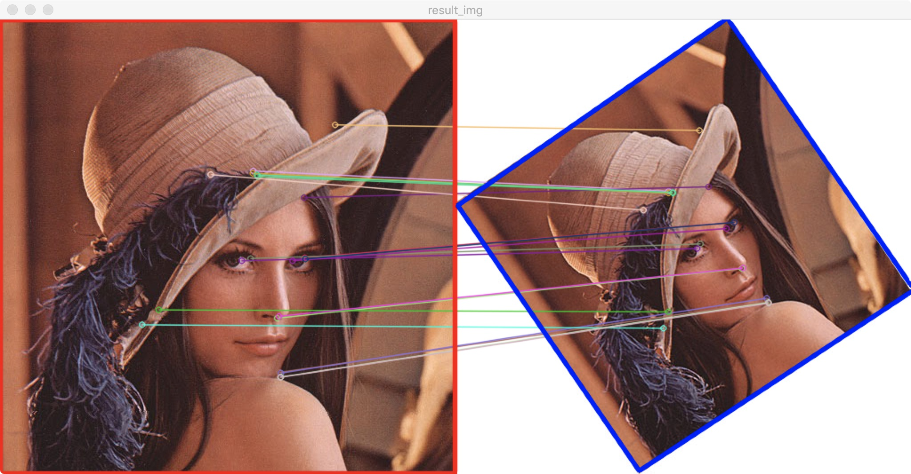

# week2
## Reading
- [ ] Bilateral Filter
- [x] Hog
- [x] SURF
- [x] BRISK
- [x] Orb
- [x] K-Means

## Coding
  - [x] Finish 2D convolution/filtering by your self. ("median blur")
    - python: [c1_median_blur.py](./c1_median_blur.py)
      - 测试: `python -m c1_median_blur_test` 
      - 过滤效果: `python -m c1_median_blur`
    - c++: [c1_median_blur.cpp](./c1_median_blur.cpp)
      - 编译运行: `cd cmake && cmake . && make && build/week2_test`

    - 寻找中位值：可以先对卷积核范围内数据排序，然后取出中间位置数据，时间复杂度为：$O(W\cdot H\cdot m\cdot n\cdot log(m\cdot n))$。也可以使用快排算法的变种 `Quick Select` 算法寻找中位值，平均时间复杂度为：$O(W\cdot H\cdot m\cdot n)$
    
    - 这里分别使用内置排序函数、手动实现的快排、`QuickSelect`算法来实现卷积函数，并在 [main.cpp](./main.cpp) 进行测试。得到如下数据：
    ```plaintext
    benchmark name              samples       iterations    estimated
                                mean          low mean      high mean
                                std dev       low std dev   high std dev
    ----------------------------------------------------------------
    quickSelectMedianValue      100           12            7.8852 ms
                                8.49 us       8.376 us      8.676 us
                                724 ns        497 ns        1.002 us
    quickSort                   100           2             13.7564 ms
                                105.796 us    104.584 us    107.549 us
                                7.323 us      5.481 us      9.515 us
    sort(系统内置)                100           60            7.77 ms
                                1.672 us      1.653 us      1.718 us
                                140 ns        69 ns         276 ns


    benchmark name              samples       iterations    estimated
                                mean          low mean      high mean
                                std dev       low std dev   high std dev
    -----------------------------------------------------------------
    medianBlur(系统内置排序)      100           1             7.00926 s
                                67.5595 ms    66.9782 ms    68.3221 ms
                                3.37242 ms    2.76047 ms    4.69736 ms
    medianBlurQuickSort         100           1             13.5275 s
                                140.899 ms    138.157 ms    145.132 ms
                                17.1199 ms    12.6515 ms    26.0634 ms
    medianBlurQuickSelect       100           1             8.78743 s
                                91.1749 ms    90.1776 ms    93.3581 ms
                                7.15069 ms    4.16801 ms    13.9579 ms
    ```
    比较出乎意料的是系统内置排序比`QuickSelect`还快。
    ___

  - [x] RANSAC algorithm

    [c2_ransac_matching.py](./c2_ransac_matching.py): `python -m c2_ransac_matching`
    
    demo 中通过 `ORB` 算法检测出两张图片的 `keypoints` 并进行匹配。匹配得到的`points A`, `points B` 作为 `RANSAC` 算法的输入，计算出变换矩阵 `H`。红色边框经过 `H` 变换得到蓝色边框。

    参考自opencv: [fundam.cpp](https://github.com/opencv/opencv/blob/4.1.0/modules/calib3d/src/fundam.cpp), [ptsetreg.cpp](https://github.com/opencv/opencv/blob/4.1.0/modules/calib3d/src/ptsetreg.cpp)
    ___
## Classical Project
  - [ ] Classical image stitching!