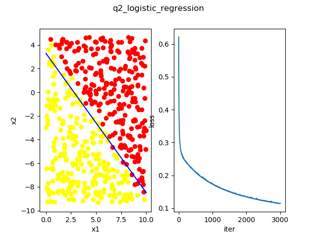

# week3

- [x] 1. Reorganize Linear Regression in Python mode.

  [q1_linear_regression.py](./q1_linear_regression.py)  

  
  ___
- [x] 2. Logistic regression:
  
  [q2_logistic_regression.py](./q2_logistic_regression.py)  

  
  ___
- [x] 3. Mathematics:
  > A person is swimming across several rivers.  
  > Speeds of those rivers are different: v1, v2, ..., vn. To simplify this problem, we only consider the speed in vertical direction.  
  > The person’s speed is v. It’s a constant, no way to change that. And the angle of the person’s velocity to horizontal line is a1, a2, ..., an.  
  > The total time for swimming is T. And, the person must pass those rivers.  
  > You are not required to give out concrete angle numbers, a “cost function” that can be derived from is enough

  
  
  <!-- $\because 水平方向速度为\: v \cdot cos \alpha_i$

  $\therefore T = \sum \limits_{i=1}^n{\frac{s_i}{v \cdot cos\alpha _i}} \;(1)$

  $\because 在第i条河通过的水平距离为s_i$

  $\therefore 垂直方向总距离\; d= \sum\limits_{i=1}^n{s_i \cdot tan \alpha _i}$

  $要在满足(1)式的条件下求d的极值，\\则极值点必在式(2)的极值点中: \\ \mathcal {L} \left(\alpha_1,\alpha_2,\ldots,\alpha_n,\lambda\right) = \sum\limits_{i=1}^n{s_i \cdot tan \alpha _i} + \lambda \left( \sum \limits_{i=1}^n{\frac{s_i}{v \cdot cos\alpha _i}} - T \right)\;(2)$

  $\therefore 可以将式(2)作为\;cost\:function$ -->
