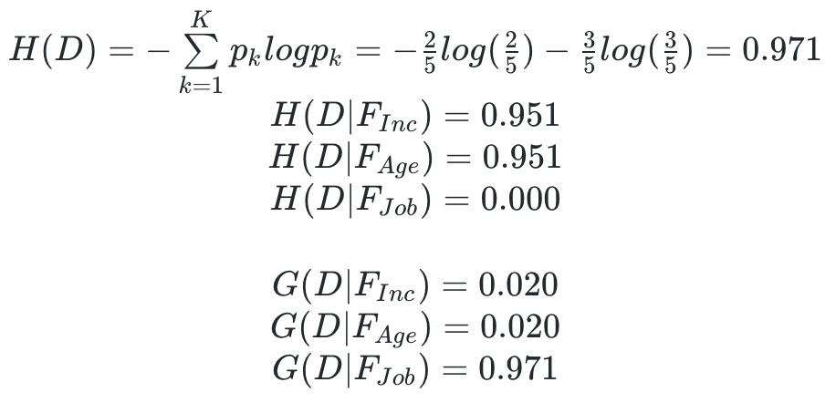
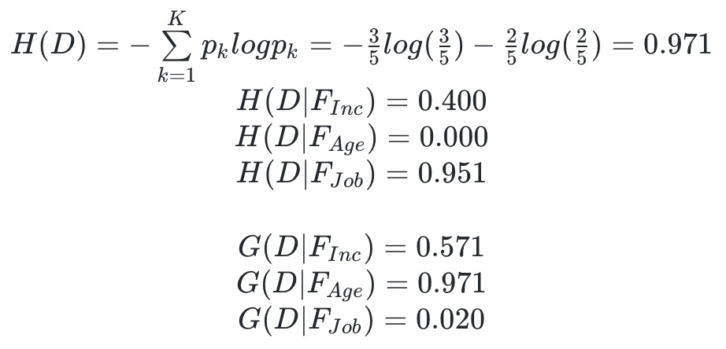
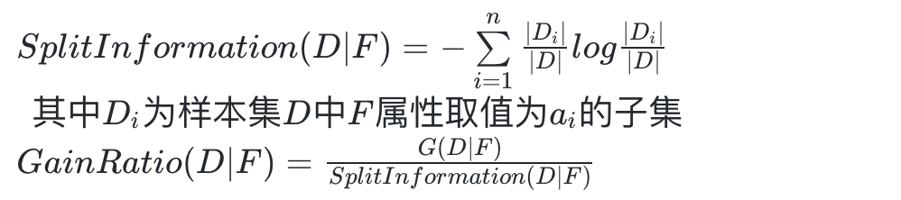
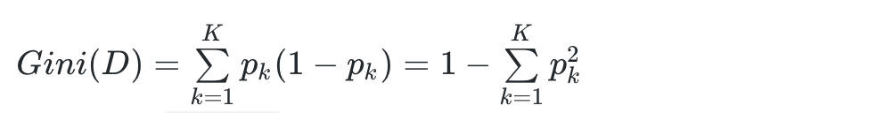

# week5

## Coding

- [x] K-Means++
  - [c1_kmeanspp.py](c1_kmeanspp.py)/`initial_centroids_kmeanspp(df, k)`
  - 效果见此 [链接](./KMeansResult.md)

## Mathematical

- [x] ID3 algorithm
  > Therefore your task is to supplyment details of calculation of each node to the tree and provide the evidence why you split a node in such way.  
  
  决策树的内部节点表示一个特征，叶节点表示一个类。构建决策树时，每个内部节点选择一个特征，将输入到这个节点的训练集按该特征值域分裂成若干个子集(分支)。

  选择特征的原则是使各个分裂的训练子集尽可能的 “纯”，即尽可能属于同一类别。

  在 `ID3` 算法中，这个 “纯” 通过信息熵来体现。对每个节点，选择一个使不确定度下降最多的特征，即信息增益最大的特征。

  - 根节点:  
    如同讲义对[14个样本](formula/m1_input.jpg)进行的计算，四个特征的增益分别为：  
    <!-- $$\begin{matrix}
      G(D \vert F_{App})=0.246 \\
      G(D \vert F_{Inc})=0.029 \\
      G(D \vert F_{Age})=0.151 \\
      G(D \vert F_{Job})=0.048 \\
    \end{matrix}$$ -->
    
  
    所以根节点选择增益最大的 `Appearance` 特征进行分裂，将样本分成三类:
    - Ah: [4,5,6,10,14] => 3Y+2N
    - Good: [1,2,8,9,11] => 2Y+3N
    - Great: [3,7,12,13] => 4Y
  - 根节点的`Ah`分支: [4,5,6,10,14] => 3Y+2N
    - Income: Good(1N+2Y) + Great(1N+1Y)
    - Age: Older(1N+1Y) + Younger(1N+2Y)
    - Profession: Steady(3Y) + Unstable(2N)
    <!-- $$\begin{matrix}
      H(D)=-\sum\limits_{k=1}^K{p_klog p_k} = -\frac{2}{5}log(\frac{2}{5})-\frac{3}{5}log(\frac{3}{5})=0.971\\
      H(D \vert F_{Inc}) = 0.951\\
      H(D \vert F_{Age}) = 0.951\\
      H(D \vert F_{Job}) = 0.000\\\\
      G(D \vert F_{Inc}) = 0.020\\
      G(D \vert F_{Age}) = 0.020\\
      G(D \vert F_{Job}) = 0.971\\
    \end{matrix}$$ -->
    
    - 选择 `Profession` 特征进行分裂，将样本分成两类:
      - Steady: [4,5,10] => 3Y
      - Unstable: [6,14] => 2N
      - `Steady` 分支全为 `Y` 样本，所以其熵为 0，子节点类别为 `Y`
      - `Unstable` 分支全为 `N` 样本，所以子节点类别为 `N`
  - 根节点的`Good`分支: [1,2,8,9,11] => 2Y+3N
    - Income: Good(1N+1Y) + Great(1Y) + Low(2N)
    - Age: Older(3N) + Younger(2Y)
    - Profession: Steady(2N+1Y) + Unstable(1N+1Y)
    <!-- $$\begin{matrix}
      H(D)=-\sum\limits_{k=1}^K{p_klog p_k} = -\frac{3}{5}log(\frac{3}{5})-\frac{2}{5}log(\frac{2}{5})=0.971\\
      H(D \vert F_{Inc}) = 0.400\\
      H(D \vert F_{Age}) = 0.000\\
      H(D \vert F_{Job}) = 0.951\\\\
      G(D \vert F_{Inc}) = 0.571\\
      G(D \vert F_{Age}) = 0.971\\
      G(D \vert F_{Job}) = 0.020\\
    \end{matrix}$$ -->
    
    - 选择 `Age` 特征进行分裂，将样本分成两类:
      - Older: [1,2,8] => 3N
      - Younger: [9,11] => 2Y
      - `Older` 分支全为 `N` 样本，子节点类别为 `N`
      - `Younger` 分支全为 `Y` 样本，子节点类别为 `Y`
  - 根节点的`Great`分支: [3,7,12,13] => 4Y
    - 全为 `Y` 样本，子节点类别为 `Y`.
  ___

- [x] C4.5, CART
  - [x] What is Gain Ratio?

    特征F对训练集D的信息增益与训练集D关于特征F的值的熵之比。

    <!-- $SplitInformation(D \vert F) = -\sum\limits_{i=1}^{n}{\frac{\vert D_i\vert}{\vert D \vert} log \frac{\vert D_i \vert}{\vert D \vert} }\\\:\:其中 D_i 为 样本集D中F属性取值为a_i的子集$
    $GainRatio(D\vert F) = \frac{G(D\vert F)}{SplitInformation(D \vert F)}$ -->
    

  - [x] Why we are prone to use Gain Ratio?

    信息增益通常对取值数目较多的属性有所偏好。例如使用样本编号作为属性，则分裂后每个子集只有一个样本，则`Conditional Entropy`为0，信息增益最大。

    信息增益比使用`SplitInformation`作为惩罚项，一般取值数目越多，惩罚越大，从而对`ID3`的缺点进行校正。

  - [x] How to split a node by using Gain Ratio?

    信息增益比一般对取值数目较多的属性有所偏好。所以一般先从候选属性中选出信息增益高于平均水平的属性，然后再选出信息增益比最高的属性。最后根据该属性的取值，将样本集分裂成若干子集。

  - [x] What Gini Index?

    <!-- $Gini(D)=\sum \limits_{k=1}^{K}{p_k(1-p_k)}=1-\sum \limits_{k=1}^{K}{p_k^2}$   -->
    
    直观来讲，`Gini(D)`反映了从样本集中随机抽取两个样本，其类别不一致的概率。
  - [x] How to split a node by using Gini Index?

    `CART`决策树为二叉决策树。设节点的样本集为D，对于每个特征A，对其可能的每个值a，根据A是否等于a将D分割成两个子集D1和D2，计算A=a时的基尼指数。从所有特征A及其所有可能的切分点a中，选择基尼指数最小的特征及切分点。

  - [x] Why people are likely to use C4.5 or CART rather than ID3?

    `C4.5`和`CART`克服了`ID3`的一些缺点。

    `ID3`对取值数目较多的属性有所偏好，`ID3`引入`SplitInformation`进行校正。

    `ID3`无法处理属性值为连续值以及属性值缺失的情况。
    `C4.5`采用二分法对连续属性进行离散化，从而支持连续属性。通过引入样本权重，对信息增益的表达式进行推广，从而支持缺失值问题。

    `CART`同样可以处理属性连续值和属性值缺失的情况。同时还可以处理回归问题、异常点检测。

## Reading

- [ ] AdaBoost: What is AdaBoost algorithm
  - [ ] a. What is a weak classifier?
  - [ ] b. What is a strong classifier?
  - [ ] c. How to combine those weakclassifiers?
  - [ ] d. How to update a weak classifier?
  - [ ] e. How to update the strong classifier?
  - [ ] f. Can you complete the mathematical derivation by hand?
- [ ] Haar Feature: What is Haar Feature
  - [ ] g. What is a Haar feature?
  - [ ] h. Can you find out any upgrade Haar features besides the original one?
  - [ ] i. Can you implement a Haar feature in Python or C++?
  - [ ] j. Can you implement the algorithm in a accelerated way? Like integral image?
  - [ ] k. How to combine Haar feature with AdaBoost?
